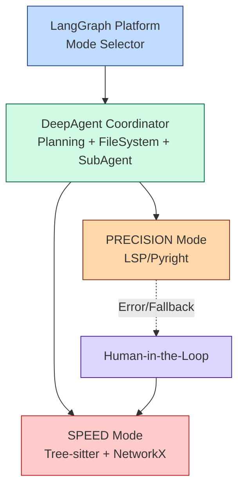

# Agentic Coding Assistant

Python 코드 영향도 분석을 위한 AI 기반 코딩 어시스턴트

## 프로젝트 개요

DeepAgent 개념(FileSystem, Planning, SubAgent)을 활용한 코드 영향도 분석 시스템입니다.
LangGraph Platform을 통해 SPEED와 PRECISION 두 가지 분석 모드를 제공합니다.

## 아키텍처



### 주요 컴포넌트

1. **LangGraph Platform**: 분석 모드 선택 인터페이스
2. **DeepAgent Coordinator**: Planning, FileSystem, SubAgent 통합 관리
3. **SPEED Mode**: Tree-sitter 기반 빠른 정적 분석 (< 5초, 10k 라인 기준)
4. **PRECISION Mode**: LSP 기반 정밀 분석 (Pyright)
5. **Human-in-the-Loop**: Fallback 메커니즘

## 주요 기능

### 🎯 영향도 분석 (Impact Analysis)

#### FR-IA-01: Dual-Mode Selection
- SPEED 모드와 PRECISION 모드 선택 인터페이스 제공
- LangGraph Platform을 통한 모드 전환

#### FR-IA-02: Speed Mode Execution
- Tree-sitter를 활용한 AST 파싱
- NetworkX 그래프 기반 의존성 분석
- 빌드 없이 5초 이내 분석 완료 (10k 라인 기준)

#### FR-IA-03: Precision Mode Execution
- LSP(Language Server Protocol) 기반 정확한 분석
- Pyright를 활용한 컴파일러 수준의 참조 찾기
- 타입 추론 및 상속 관계 정확한 해석

#### FR-IA-04: Fallback Mechanism
- PRECISION 모드 실행 실패 시 SPEED 모드 전환 제안
- Human-in-the-Loop 구현

### 🔧 자율 코딩 및 복구 (Autonomous Coding & Recovery)

#### FR-AC-01: Refactoring Execution
- 영향도 분석 결과 기반 자동 코드 수정
- 사용자 요청 의도에 맞는 리팩토링 실행

#### FR-AC-02: Self-Healing Loop
- 컴파일 에러/테스트 실패 시 자동 수정
- 최대 3회 재시도로 자동 복구
- 실패 시 사용자에게 상세 히스토리 제공

#### FR-AC-03: Test Generation
- 변경된 코드에 대한 단위 테스트 자동 생성
- pytest/unittest 프레임워크 지원
- 자동 테스트 실행 및 검증

### 📚 문서화 동기화 (Documentation Sync)

#### FR-DS-01: Automatic Documentation Sync
- 코드 변경 시 관련 문서 자동 업데이트 감지
- Docstring, README, Swagger/API 문서 동기화
- 변경안 제시 및 Human-in-the-Loop 승인

### 📂 파일 시스템 심층 탐색 (Deep File System)

#### FR-FS-01: Contextual Exploration
- DeepAgents Library의 FileSystemBackend 활용
- `ls`, `read_file`로 프로젝트 컨텍스트 자동 파악

#### FR-FS-02: Pattern-based Search
- `glob` 패턴 매칭으로 파일 검색
- `grep` 문자열 검색으로 코드 위치 식별

#### FR-FS-03: Precise Code Modification
- `edit_file`로 정확한 문자열 치환
- `write_file`로 새 파일 생성

#### FR-FS-04: Large Output Handling
- 대용량 파일 자동 감지 및 캐싱
- LLM 기반 요약 생성
- SubAgent 호출 및 Human-in-the-Loop

## 설치 및 실행

### 1. 환경 설정

```bash
# 저장소 클론
git clone <repository-url>
cd project-ax-advanced

# 가상환경 생성 및 활성화
python -m venv venv
source venv/bin/activate  # Windows: venv\Scripts\activate

# 의존성 설치
pip install -e .

# OpenRouter API 키 설정
cp .env.example .env
# .env 파일을 편집하여 OPENROUTER_API_KEY 설정
```

## 사용 방법

### 1. LangGraph 서버 실행

```bash
langgraph dev
```

### 2. 영향도 분석 실행

```python
from agentic_coding_assistant import ImpactAnalyzer

# SPEED 모드
analyzer = ImpactAnalyzer(mode="SPEED")
results = analyzer.analyze(
    file_path="path/to/file.py",
    symbol_name="function_name"
)

# PRECISION 모드
analyzer = ImpactAnalyzer(mode="PRECISION")
results = analyzer.analyze(
    file_path="path/to/file.py",
    symbol_name="function_name"
)
```

## 프로젝트 구조

```
src/agentic_coding_assistant/
├── agents/          # DeepAgent 구현
├── analyzers/       # SPEED/PRECISION 분석기
├── models/          # 데이터 모델
├── nodes/           # LangGraph 노드
├── prompts/         # LLM 프롬프트
├── tools/           # 분석 도구
└── utils/           # 유틸리티 함수
```

## 기술 스택

- **DeepAgents**: Planning, FileSystem, SubAgent 구현
- **LangGraph**: 워크플로우 오케스트레이션
- **Tree-sitter**: AST 파싱 (SPEED 모드)
- **NetworkX**: 그래프 분석
- **Pyright/LSP**: 정밀 코드 분석 (PRECISION 모드)
- **FastAPI**: API 서버

## 참고 자료

- [DeepAgents Blog Post](https://blog.langchain.com/doubling-down-on-deepagents/)
- [DeepAgents Documentation](https://docs.langchain.com/oss/python/deepagents/overview)
- [LangGraph Documentation](https://langchain-ai.github.io/langgraph/)

## 문서

- **아키텍처 설계**: `docs/architecture.excalidraw`, `docs/architecture_detailed.md`
- **구현 세부사항**: `docs/IMPLEMENTATION.md`
- **빠른 시작**: `docs/QUICKSTART.md`
- **프로젝트 요약**: `docs/PROJECT_SUMMARY.md`
- **고급 기능**: `docs/ADVANCED_FEATURES.md` 🆕
- **DeepAgent 통합**: `docs/DEEPAGENT_INTEGRATION.md` 🆕
- **예제**: 
  - `examples/self_healing_demo.py` - 자율 코딩 및 복구
  - `examples/filesystem_demo.py` - 파일 시스템 탐색
  - `examples/documentation_demo.py` - 문서화 동기화
  - `examples/complete_workflow_demo.py` - 전체 워크플로우
  - `examples/deep_agent_demo.py` - DeepAgent 프레임워크 사용 🆕

## 요구사항 충족 현황

### ✅ 설계 요구사항
- Excalidraw 아키텍처 다이어그램 제공 (`docs/architecture.excalidraw`)
- 상세 Mermaid 다이어그램 제공 (`README.md`, `docs/architecture_detailed.md`)

### ✅ 구현 요구사항

#### 영향도 분석 (Impact Analysis)
- **DeepAgent 패턴**: Planning, FileSystem, SubAgent 구현
- **프로그래밍 언어**: Python 전용
- **FR-IA-01**: LangGraph Platform 기반 Dual-Mode Selection
- **FR-IA-02**: Tree-sitter + NetworkX 기반 SPEED 모드 (< 5초)
- **FR-IA-03**: LSP/Pyright 기반 PRECISION 모드
- **FR-IA-04**: Human-in-the-Loop Fallback 메커니즘

#### 자율 코딩 및 복구 (Autonomous Coding) 🆕
- **FR-AC-01**: 영향도 분석 기반 Refactoring 실행
- **FR-AC-02**: Self-Healing Loop (최대 3회 재시도)
- **FR-AC-03**: 단위 테스트 자동 생성 및 실행

#### 문서화 동기화 (Documentation Sync) 🆕
- **FR-DS-01**: Docstring, README, Swagger 문서 자동 동기화

#### 파일 시스템 탐색 (File System) 🆕
- **✨ create_deep_agent 사용**: DeepAgent 패턴 자동 적용
- **FR-FS-02**: glob/grep 기반 패턴 검색
- **FR-FS-03**: edit_file/write_file로 정확한 코드 수정
- **FR-FS-04**: 대용량 파일 처리 및 Human-in-the-Loop

## 라이센스

MIT License

## 기여

Pull Requests와 Issues를 환영합니다!

## 작성자

Agentic Coding Assistant Team
