# Detailed Architecture Diagram

**버전**: 0.2.0  
**최종 업데이트**: 2024-11-20

## System Architecture (v0.2.0)

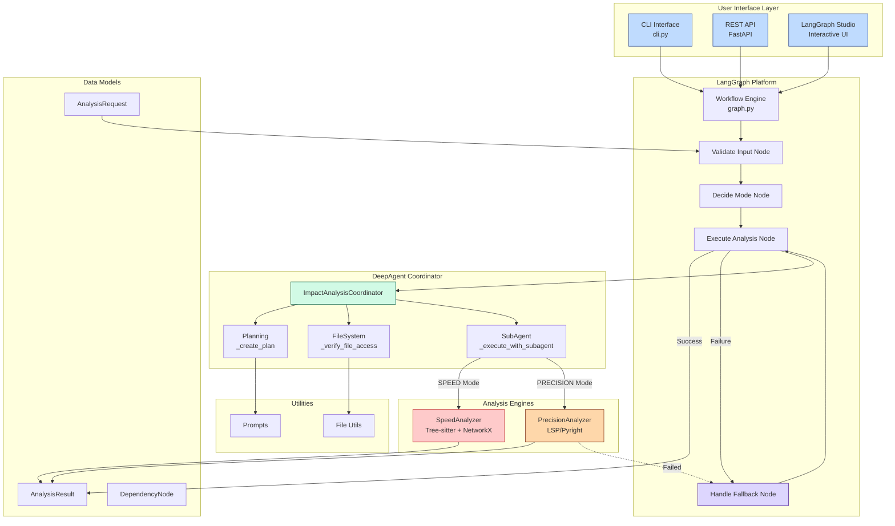

## Component Flow Diagram

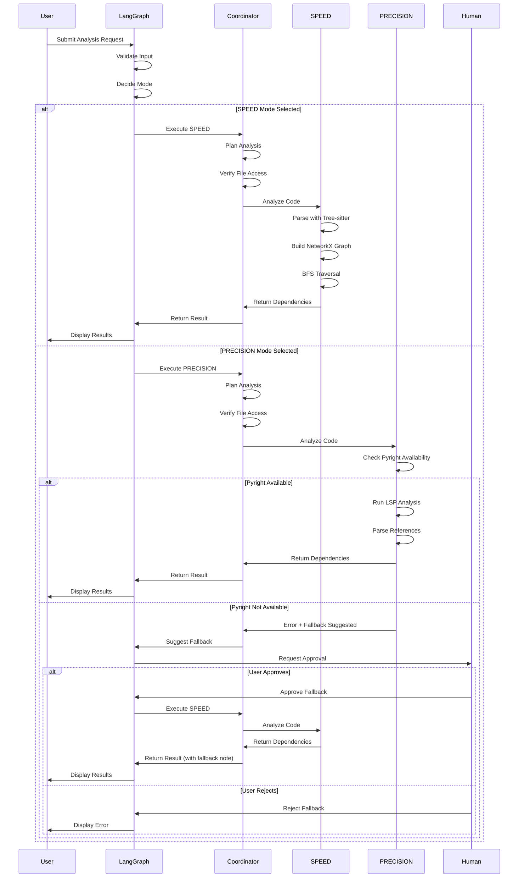

## Data Flow Diagram

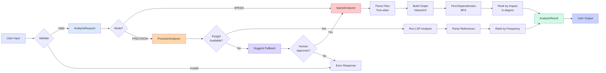

## DeepAgent Pattern Implementation

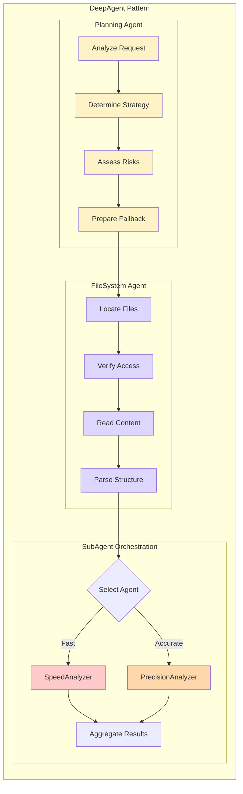

## SPEED Mode Internal Flow

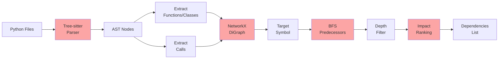

## PRECISION Mode Internal Flow

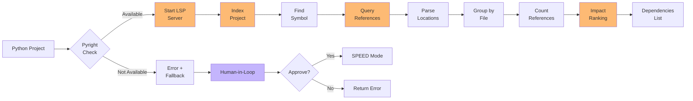

## State Management in LangGraph

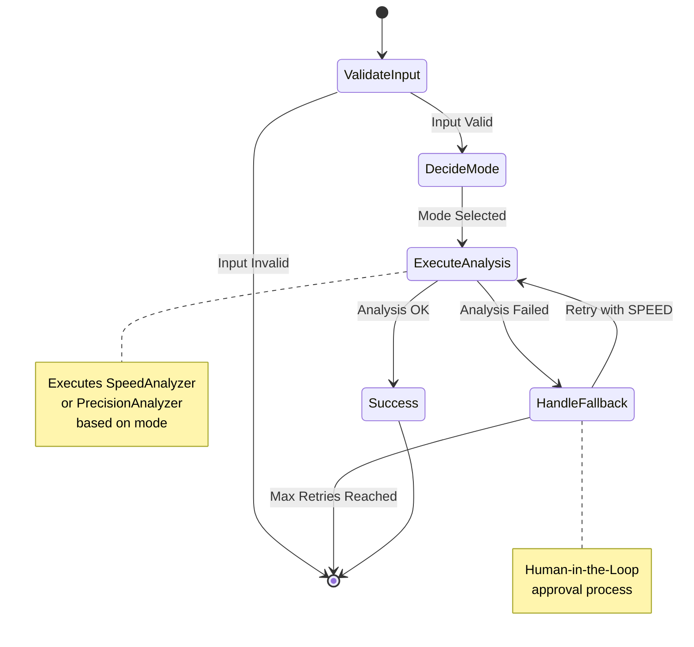

## Complete System Overview

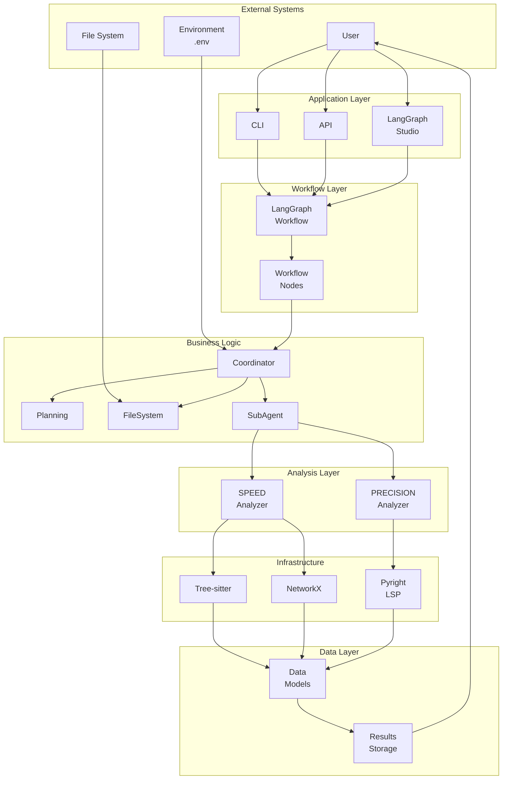

---

## Legend

### Colors
- 🔵 **Blue**: User Interfaces (CLI, API, Studio)
- 🟢 **Green**: Coordinator & Business Logic
- 🔴 **Red**: SPEED Mode Components
- 🟠 **Orange**: PRECISION Mode Components
- 🟣 **Purple**: Human-in-the-Loop & Fallback

### Node Shapes
- **Rectangle**: Process/Component
- **Diamond**: Decision Point
- **Circle**: State
- **Hexagon**: External System

### Edge Styles
- **Solid Line**: Normal Flow
- **Dashed Line**: Fallback Flow
- **Dotted Line**: Optional Flow

---

## v0.2.0 Extended Architecture

### Advanced Agents System

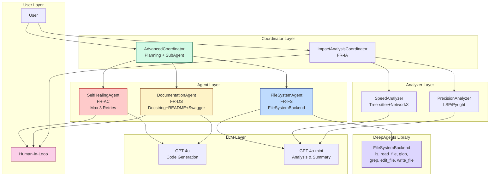

### Self-Healing Workflow

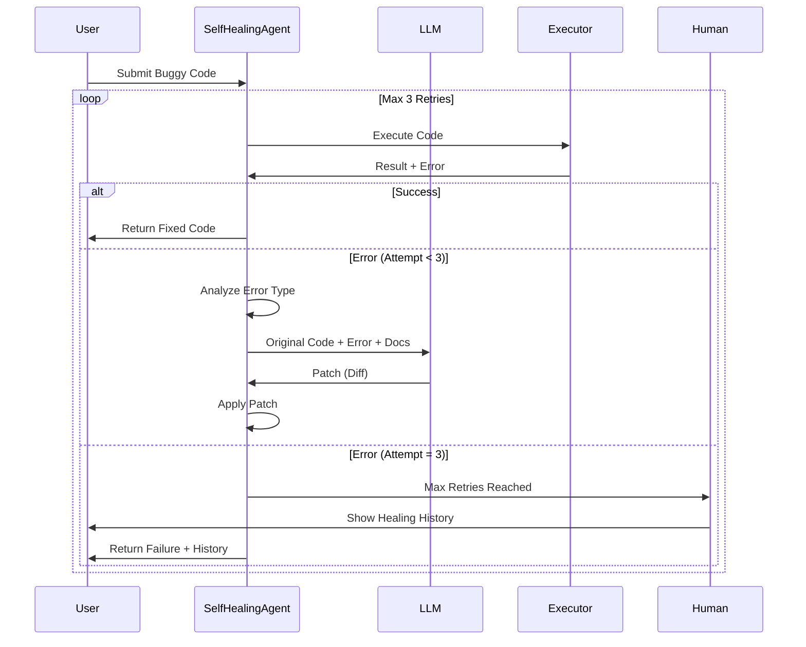

### FileSystem Operations Flow

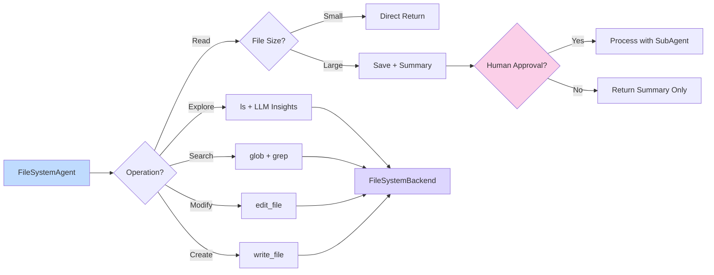

### Documentation Sync Workflow

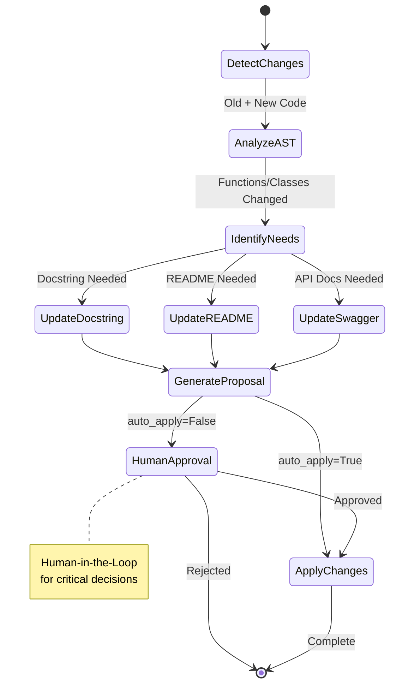

### Integrated Workflow (AdvancedCoordinator)

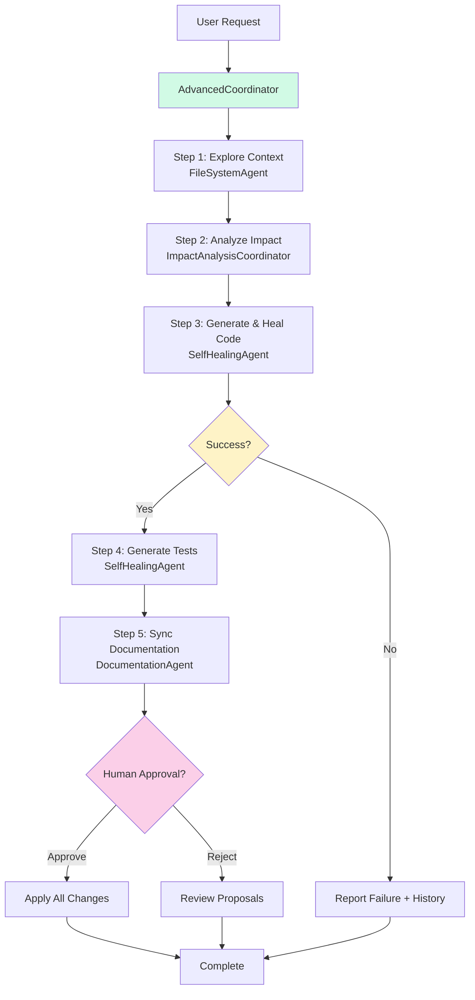

---

## Component Responsibilities

### FileSystemAgent (FR-FS)
- **FR-FS-01**: Contextual exploration with `ls` and `read_file`
- **FR-FS-02**: Pattern search with `glob` and `grep`
- **FR-FS-03**: Code modification with `edit_file` and `write_file`
- **FR-FS-04**: Large output handling with caching and Human-in-Loop

### SelfHealingAgent (FR-AC)
- **FR-AC-01**: Refactoring execution based on impact analysis
- **FR-AC-02**: Self-healing loop (Execute → Analyze → Patch → Retry, Max 3)
- **FR-AC-03**: Automatic test generation (pytest/unittest)

### DocumentationAgent (FR-DS)
- **FR-DS-01**: Automatic documentation sync
  - Docstring generation and updates
  - README synchronization
  - Swagger/API documentation updates
  - AST-based change detection
  - Human-in-Loop approval

### AdvancedCoordinator
- **Planning**: Orchestrate complete workflow
- **FileSystem**: Integrate FileSystemAgent
- **SubAgent**: Delegate to specialized agents
- **Human-in-Loop**: Manage approval flow

---

## Technology Stack by Component

| Component | Technologies |
|-----------|-------------|
| **FileSystemAgent** | DeepAgents FileSystemBackend, GPT-4o-mini |
| **SelfHealingAgent** | GPT-4o, subprocess, pytest |
| **DocumentationAgent** | GPT-4o, AST parsing |
| **ImpactAnalysisCoordinator** | Tree-sitter, NetworkX, Pyright, GPT-4o-mini |
| **AdvancedCoordinator** | LangChain, async/await |

---

**버전**: 0.2.0  
**문서 인덱스**: [INDEX.md](INDEX.md)
