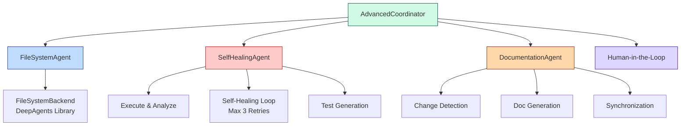

# Advanced Features Documentation

This document describes the advanced features implemented using DeepAgents Library.

## Table of Contents

- [Overview](#overview)
- [FR-FS: File System Deep Exploration](#fr-fs-file-system-deep-exploration)
- [FR-AC: Autonomous Coding and Recovery](#fr-ac-autonomous-coding-and-recovery)
- [FR-DS: Documentation Synchronization](#fr-ds-documentation-synchronization)
- [Integration](#integration)
- [Examples](#examples)

## Overview

The advanced features build on the DeepAgent pattern (Planning + FileSystem + SubAgent) to provide:

1. **Deep File System Exploration** - Contextual code understanding
2. **Self-Healing Code Generation** - Automatic error recovery (max 3 retries)
3. **Documentation Synchronization** - Keep docs in sync with code changes

All features leverage the **DeepAgents Library** with `FileSystemBackend`.

## FR-FS: File System Deep Exploration

### FR-FS-01: Contextual Exploration

**Purpose:** Understand project structure and development context using `ls` and `read_file`.

**Implementation:**
```python
from agentic_coding_assistant.agents import FileSystemAgent

agent = FileSystemAgent(work_dir="/path/to/project")
context = await agent.explore_context("src")

print(context["structure"])  # Directory listing
print(context["insights"])   # LLM-generated insights
```

**Features:**
- Automatic directory traversal
- LLM-powered context analysis
- Project type detection
- Configuration file identification

### FR-FS-02: Pattern-based Search

**Purpose:** Find files and code using glob patterns and grep.

**Implementation:**
```python
# Find all Python files
results = await agent.pattern_search(pattern="**/*.py")

# Search for specific text
grep_results = await agent.pattern_search(
    query="DeepAgent",
    extension="py"
)
```

**Features:**
- Glob pattern matching
- Full-text search (grep)
- File extension filtering
- Combined pattern + text search

### FR-FS-03: Precise Code Modification

**Purpose:** Edit files with exact string replacement using `edit_file`.

**Implementation:**
```python
result = await agent.modify_code(
    file_path="module.py",
    old_string="def old_function():",
    new_string="def new_function():"
)
```

**Features:**
- Exact string matching
- Safe replacement (no regex confusion)
- Verification of changes
- Rollback on error

### FR-FS-04: Large Output Handling

**Purpose:** Handle large files that exceed token limits with Human-in-the-Loop.

**Implementation:**
```python
# Automatic large file detection
result = await agent.read_file_safe("large_file.py")

if result["type"] == "large_file":
    print(f"Saved to: {result['saved_to']}")
    print(f"Summary: {result['summary']}")
    
    # Human approval required
    if result["human_in_loop_required"]:
        # Request human decision
        pass
```

**Features:**
- Automatic token estimation
- File caching for large outputs
- LLM-generated summaries
- Human-in-the-Loop integration
- SubAgent for processing (optional)

**Process Flow:**
```
Read File → Check Size → Large?
                           ├─ No  → Return Content
                           └─ Yes → Save to Cache
                                   → Generate Summary
                                   → Request Human Approval
                                   → Process if Approved
```

## FR-AC: Autonomous Coding and Recovery

### FR-AC-01: Refactoring Execution

**Purpose:** Generate code modifications based on user intent.

**Implementation:**
```python
from agentic_coding_assistant.agents import SelfHealingAgent

agent = SelfHealingAgent(work_dir="/path/to/project")

result = await agent.refactor_with_tests(
    code=original_code,
    file_path="module.py",
    related_docs="Best practices: type hints, docstrings"
)
```

**Features:**
- LLM-powered code generation
- Best practices integration
- Related documentation context
- Automatic test generation

### FR-AC-02: Self-Healing Loop

**Purpose:** Automatically fix compilation/test errors (max 3 retries).

**Process Flow:**
```
1. Execute  → Run code/tests
2. Analyze  → Parse error messages, classify error type
3. Prompting → Send Original Code + Error Log + Docs to LLM
4. Patch    → Apply LLM-generated fix (Diff)
5. Retry    → Increment retry count, goto 1 (max 3 times)
```

**Implementation:**
```python
result = await agent.self_heal(
    code=broken_code,
    file_path="module.py",
    test_command="pytest test_module.py"
)

print(f"Success: {result['success']}")
print(f"Attempts: {result['attempts']}")
print(f"Final code: {result['final_code']}")
```

**Error Classification:**
- `SyntaxError` - Python syntax errors
- `ImportError` - Missing imports/modules
- `TypeError` - Type-related errors
- `NameError` - Undefined variables
- `AttributeError` - Missing attributes
- `TestFailure` - Test assertion failures
- `RuntimeError` - Runtime exceptions

**Retry Strategy:**
- **Attempt 1:** Basic fix based on error message
- **Attempt 2:** Consider related code context
- **Attempt 3:** Alternative approach with stricter validation

**Failure Handling:**
If max retries (3) reached without success:
- Stop execution loop
- Return failure status with last error
- Notify user with healing history
- Provide manual intervention option

### FR-AC-03: Test Generation

**Purpose:** Automatically generate unit tests for modified code.

**Implementation:**
```python
test_code = await agent.generate_unit_tests(
    code=modified_code,
    file_path="module.py",
    framework="pytest"
)
```

**Features:**
- Framework selection (pytest, unittest)
- Happy path coverage
- Edge case testing
- Error condition handling
- Example-based tests

**Test Coverage:**
- Normal execution paths
- Boundary values
- Error conditions
- Type validation
- Integration scenarios

## FR-DS: Documentation Synchronization

### FR-DS-01: Automatic Documentation Updates

**Purpose:** Keep documentation synchronized with code changes.

**Supported Documentation Types:**
1. **Docstrings** - Function/class documentation
2. **README.md** - Project documentation
3. **Swagger/API Docs** - API specifications

**Implementation:**
```python
from agentic_coding_assistant.agents import DocumentationAgent

agent = DocumentationAgent()

result = await agent.synchronize_documentation(
    old_code=original_code,
    new_code=modified_code,
    file_path="module.py",
    project_root=Path("/path/to/project"),
    auto_apply=False  # Request human approval
)

# Review proposed updates
for update in result['proposed_updates']:
    print(f"Type: {update['type']}")
    print(f"Reason: {update['reason']}")
    print(f"Proposal: {update['proposed_preview']}")
```

**Features:**
- Automatic change detection
- Context-aware updates
- Style preservation
- Human approval workflow

**Change Detection:**
- Function signature changes
- New functions/classes
- Docstring modifications
- Import changes

## Integration

### AdvancedCoordinator

The `AdvancedCoordinator` orchestrates all agents:

```python
from agentic_coding_assistant.agents import AdvancedCoordinator

coordinator = AdvancedCoordinator(project_root="/path/to/project")

# Complete workflow
result = await coordinator.complete_workflow(
    user_request="Add type hints and error handling",
    target_files=["module.py"],
    human_callback=lambda msg: True  # Human-in-the-Loop
)
```

**Workflow Steps:**
1. **Explore** - Understand project context (FR-FS-01)
2. **Search** - Find target files (FR-FS-02)
3. **Heal** - Generate and fix code (FR-AC-01, FR-AC-02)
4. **Test** - Generate and run tests (FR-AC-03)
5. **Document** - Sync documentation (FR-DS-01)
6. **Review** - Human approval for large changes (FR-FS-04)

### Human-in-the-Loop

Callback function for human decisions:

```python
def human_callback(message: str) -> bool:
    """
    Args:
        message: Description of the decision needed
        
    Returns:
        True to proceed, False to cancel
    """
    print(message)
    return input("Proceed? (y/n): ").lower() == 'y'

# Use in coordinator
result = await coordinator.refactor_with_healing(
    code=code,
    file_path="module.py",
    human_callback=human_callback
)
```

## Examples

### Complete Examples

1. **Self-Healing Demo** (`examples/self_healing_demo.py`)
   - Basic error recovery
   - Test generation
   - Complex multi-error scenarios

2. **FileSystem Demo** (`examples/filesystem_demo.py`)
   - Project exploration
   - Pattern search
   - Precise modifications
   - Large file handling

3. **Documentation Demo** (`examples/documentation_demo.py`)
   - Docstring generation
   - README updates
   - API documentation sync

4. **Complete Workflow** (`examples/complete_workflow_demo.py`)
   - End-to-end refactoring
   - All features integrated
   - Real-world scenarios

### Quick Start

```bash
# Run self-healing demo
python examples/self_healing_demo.py

# Run filesystem demo
python examples/filesystem_demo.py

# Run documentation demo
python examples/documentation_demo.py

# Run complete workflow
python examples/complete_workflow_demo.py
```

## Architecture



## Technology Stack

- **DeepAgents Library** (`deepagents>=0.2.5`) - FileSystemBackend, Tools
- **LangChain** - LLM integration, message handling
- **OpenAI GPT-4o** - Code generation and healing
- **Python AST** - Code analysis
- **Subprocess** - Code execution and testing

## Best Practices

### For Self-Healing

1. **Provide Context** - Include related documentation
2. **Limit Scope** - Focus on specific modules
3. **Review Results** - Always verify healed code
4. **Use Tests** - Generate tests to validate changes

### For Documentation

1. **Auto-apply with Caution** - Review before applying
2. **Maintain Style** - Preserve existing documentation style
3. **Update Incrementally** - Sync docs with each change
4. **Version Control** - Commit doc changes separately

### For Large Files

1. **Use Summaries** - Process summaries first
2. **Human Review** - Always involve humans for large changes
3. **Cache Results** - Save processed results to disk
4. **SubAgent Processing** - Delegate to specialized agents

## Limitations

1. **LLM Dependencies** - Requires OpenAI API access
2. **Token Limits** - Large files need special handling
3. **Retry Limit** - Max 3 attempts for self-healing
4. **Language Support** - Python-focused (extensible to other languages)

## Future Enhancements

- [ ] Multi-language support (JavaScript, TypeScript, etc.)
- [ ] Advanced code metrics integration
- [ ] Incremental healing with state persistence
- [ ] Visual diff for documentation changes
- [ ] Integration with git for automatic commits

## References

- [DeepAgents Blog Post](https://blog.langchain.com/doubling-down-on-deepagents/)
- [DeepAgents Documentation](https://docs.langchain.com/oss/python/deepagents/overview)
- [FileSystemBackend Guide](https://docs.langchain.com/oss/python/deepagents/backends#filesystembackend-local-disk)
- [Production Template](https://github.com/wassim249/fastapi-langgraph-agent-production-ready-template)
